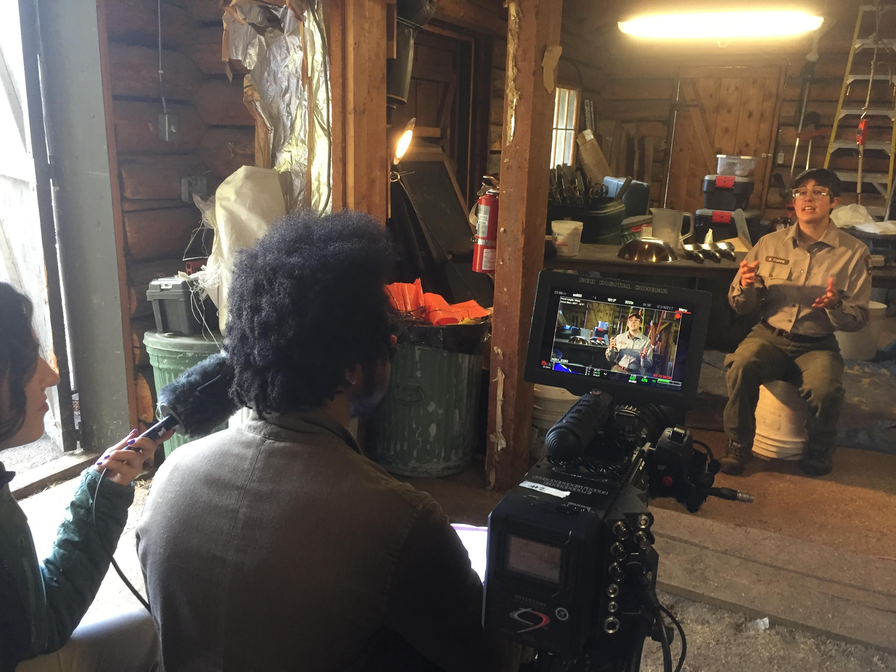

 

 
 I enjoy making short films on science when I can. You can see a few of my pieces below. 
 
 The first is a piece on ecological restoration I was able to make as a [Jackson Wild Media Fellow](https://www.jacksonwild.org/2019-media-lab-fellows.html). 
 
 The second is one of the first I ever made. It is about Isla Coiba, a former prison island off the Pacific coast of Panama, which is now a biodiversity sanctuary used for biology education and research purposes.

 

 

 

 
### The Sage Seed
 
For more than half a century, people have altered the ecosystem in the Kelly Hayfields of Grand
Teton National Park. Historically, food for cattle was grown in the fields. Now, park scientists
aim to bring back native plants and animals by undertaking rigorous restoration work. The story
of the Kelly Hayfields demonstrates that present-day actions cascade into the future, and we
may never see the outcome. As values shift and generations of land stewards come and go, it is
clear that we must care about environmental consequences for those people, plants, and
animals who will live in the future. Below is a preview, the full video can be found [here](https://vimeo.com/363666875/6b37526a61).
 

<video class = "vid" controls>
  <source src="images/The Sage Seed short.mp4" type="video/mp4">
</video>

### Coiba: From Prison to Biodiversity Sanctuary 

Once a deadly prison on an Island meant to keep prisoners in, Coiba is now a biodiversity sanctuary. Its past as a penal colony means that the ecosystem was left undisturbed, inadvertently creating one of the most biologically pristine sites in Panama. Now students and interested peoples from around the world can come to Coiba to learn about biodiversity and the science that goes into understanding it. Below is a preview,  the full video can be found [here](https://www.youtube.com/watch?v=Pl11OsmO0C0).  

<video class = "vid" controls>
  <source src="images/coiba-short.mp4" type="video/mp4">
</video>

# Acknowledgments {.appendix}

I'd like to thank my team members on 'The Sage Seed', Alex Wiles, Sarika Khanwilkar, Reyhaneh Maktoufi who I worked together with to produce that video.