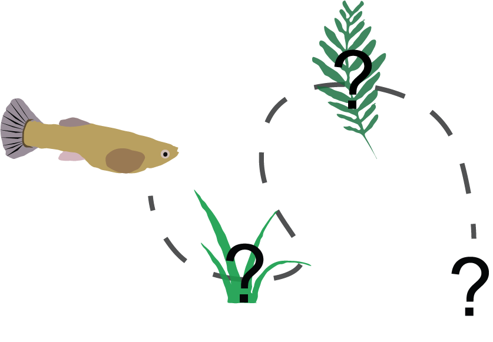
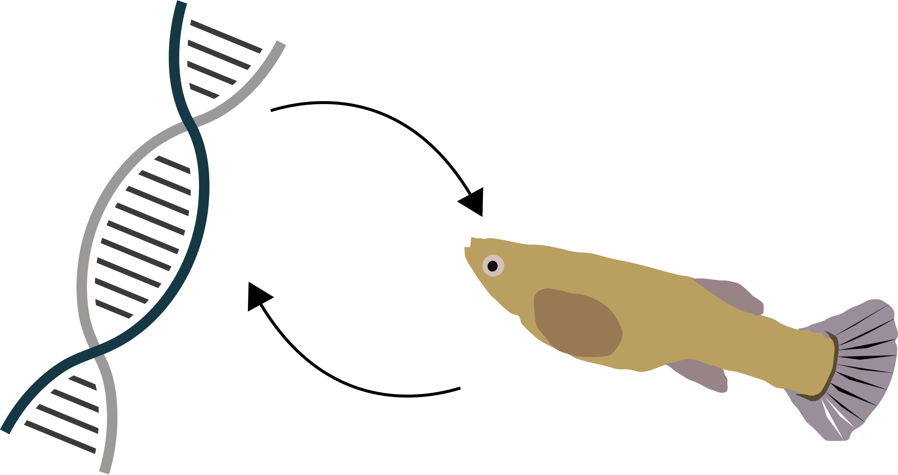

  

### Automated behaviour quantification

My research involves collecting a lot of positional behavioural data but the manual collection of behavioural data can be time consuming and potentially prone to errors that are difficult to detect without repeating an already long process of manually measuring the positions of the animal. Automated tracking allows me to rapidly process behavioural data and obtain more detailed and reliable data.

To track animals automatically I use computer-vision scripts made via Python programming. A lot of software that tracks animals for researchers is proprietary and expensive so I have put out a guide to making simple scripts which should be suitable for a number of common animal behaviour applications. The guide is available [here](https://wyatt-toure.github.io/animal-tracking-guide/).

  
  

### Experiential effects on exploratory behaviour

Trinidadian guppies have been observed to vary consistently in their exploratory behaviour, defined as their responses to novelty. Their exploratory tendencies also tend to be correlated across contexts so a guppy that explores objects typically also explores novel areas and prefers novel mates. 

I am trying to examine whether there is a role for experience in the environment in shaping exploratory behaviour and to look at the consequences of behavioural correlations across novelty contexts. 

  

### The genetics of brain size 

In guppies, the expression level of a single gene, *Ang-1* has been implicated in producing large brain size differences among guppy lines. However, this has only been demonstrated in guppies artificially selected for brain size. These changes in brain size lead to marked differences in cognitive performance with important consequences for reproductive success. However, it is unknown to what extent *Ang-1* plays a role in natural brain size variation. 

As part of an internship I am trying to determine whether natural variation in brain size can be explained by variation in *Ang-1* expression.

  

