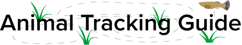
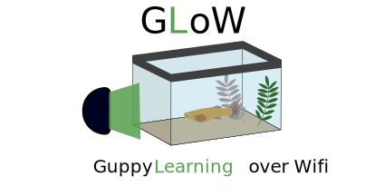

  

### Guppy colour learning

For guppies, colour factors into almost every aspect of their lives. It
determines what a guppy will eat, who a guppy will mate with, and how likely a
guppy is to be predated. Unlearned colour biases have been extensively
documented within guppies, likely arising from the ecological and evolutionary
importance of colour in guppy biology. However, it has not been demonstrated
whether biases similarly influence what colours guppies learn about. In two
experiments I documented consistent biases for green over blue in lab-reared
wild-derived guppies. There's some interesting literature implicating blue as a
difficult colour for guppies to forage from as a result of constraints arising
from either evolutionary or mechanistic constraints. More work would be needed
to be sure.

This project is published as [Toure, M. W., & Reader, S. M. (2021). Colour
biases in learned foraging preferences in Trinidadian guppies.
Ethology, 00, 1-12](https://doi.org/10.1111/eth.13237). You can read more
supplementary details about this work at the website for the project at
<https://wyatt-toure.github.io/guppy-colour-learning/>.

  

### Automated behaviour quantification

My research involves collecting a lot of positional behavioural data but the
manual collection of behavioural data can be time consuming and potentially
prone to errors that are difficult to detect without repeating an already long
process of manually measuring the positions of the animal. Automated tracking
allows me to rapidly process behavioural data and obtain more detailed and
reliable data.

To track animals automatically I use computer-vision scripts made via Python
programming. A lot of software that tracks animals for researchers is either
proprietary and expensive or very complex even though only a simple situation
may be needed so I have put out a guide to making simple but powerful scripts
which should be suitable for a number of common animal behaviour applications.
The guide will be available soon.

  
  

### Automated behaviour experiments

I supervised the Honour's project of Beatriz Quineche. We (mainly Beatriz)
designed an automatic experimental setup using a Raspberry Pi 4 and Python
programming to automate the conduction of learning experiments in guppies. This
was particularly useful given COVID restrictions meant lab access was limited —
with this setup experiments could be conducted from home.

To validate whether learning was possible with this automated method, Beatriz
conducted a simple proof-of-concept, classical conditioning learning experiment
where fish would learn that a light stimulus predicts feeding time. We
incorporated automated tracking to collect the data. You can learn more about
this at the (currently incomplete) project site for the experiment:
<https://wyatt-toure.github.io/guppy-automated-learning-chamber>.

  

### Experiential effects on exploratory behaviour

Trinidadian guppies have been observed to vary consistently in their exploratory
behaviour, defined as their responses to novelty. Their exploratory tendencies
also tend to be correlated across contexts so a guppy that explores objects
typically also explores novel areas and prefers novel mates.

I am trying to examine whether there is a role for experience in the environment
in shaping exploratory behaviour. Additionally, I am investigating whether there
are impacts on behavioural plasticity due to behavioural correlations we observe
across novelty contexts.

You can see an example of individual variation in guppy behaviour from some of
my guppy data in the data animation to the right.

  
  

### The genetics of brain size 

In guppies, the expression level of a single gene, *Ang-1* has been implicated
in producing large brain size differences among guppy lines. However, this has
only been demonstrated in guppies artificially selected for brain size. These
changes in brain size lead to marked differences in cognitive performance with
important consequences for reproductive success. However, it is unknown to what
extent *Ang-1* plays a role in natural brain size variation. 

As part of an internship I am trying to determine whether natural variation in
brain size can be explained by variation in *Ang-1* expression.

  

